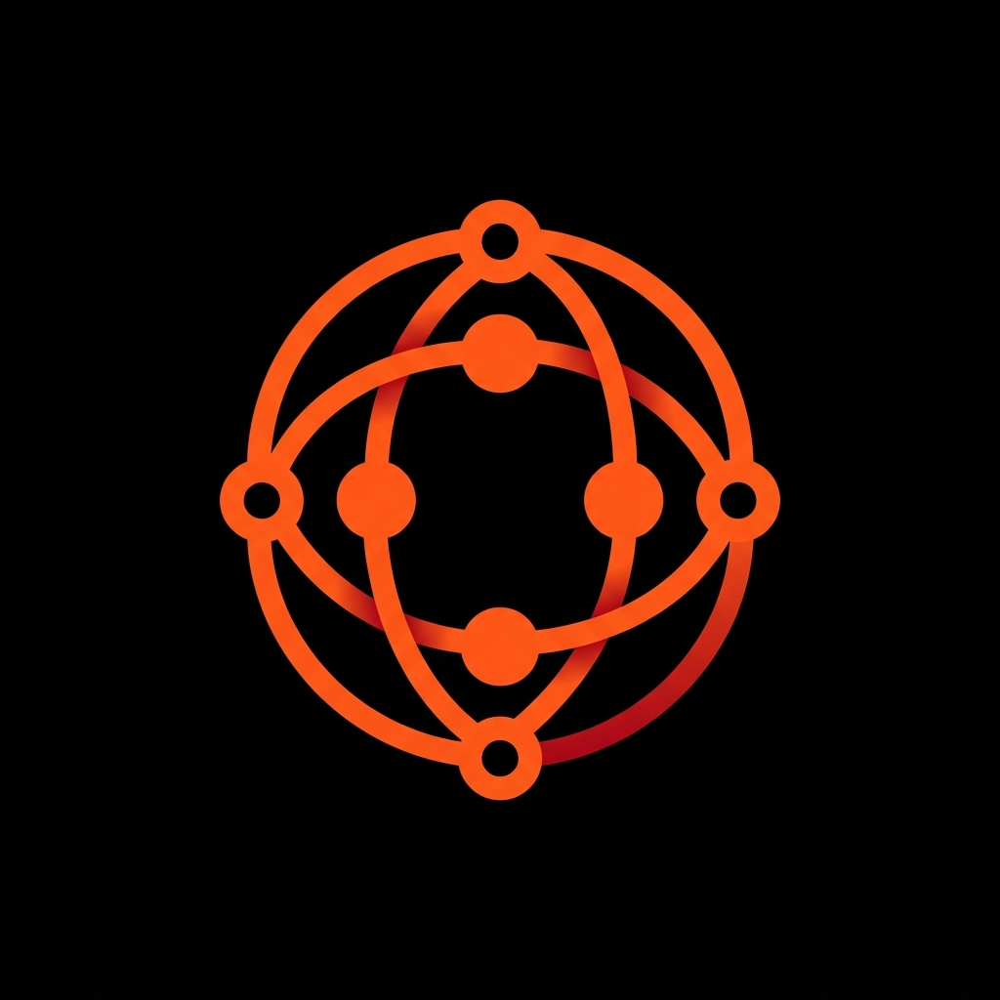
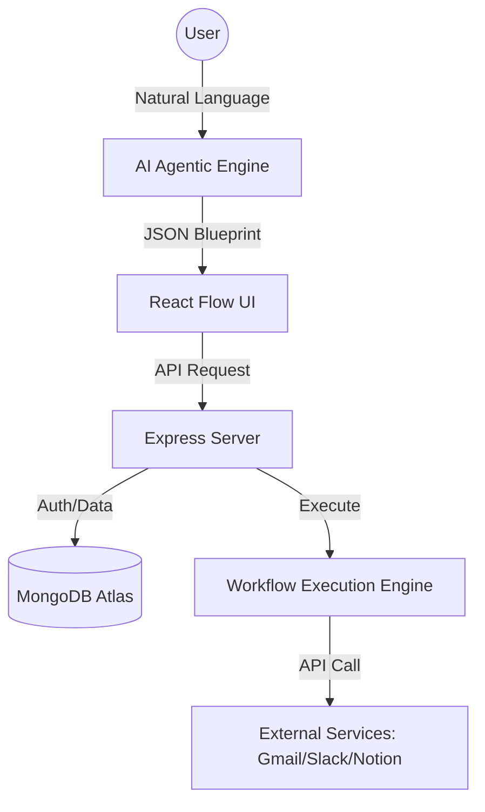

<p align="center">
  
</p>

<h1 align="center">⚡ ORvexia: The Agentic AI Workflow Architect</h1>

<p align="center">
  <strong>"Automate Beyond Limits. Turn Natural Language into Executable Infrastructure."</strong>
</p>

<p align="center">
  
  
  
</p>

---

## 🌐 Overview

**ORvexia** is a high-fidelity, agentic AI platform designed to democratize complex software automation. By combining natural language processing with a robust node-based execution engine, ORvexia allows non-technical users to build, monitor, and scale enterprise-grade automation architectures simply by describing their intent.

Unlike traditional automation tools that require deep knowledge of webhooks and JSON, ORvexia's **Agentic Copilot** acts as a Senior Workflow Architect, translating abstract ideas into precise, connected, and executable logical flows.

---

## 🖼️ Platform Preview

<p align="center">
  <!-- PLACEHOLDER FOR MAIN DASHBOARD IMAGE -->
  
</p>

<p align="center">
  <em>(Space for Real-time Dashboard Analytics)</em>
</p>

---

## ✨ Key Features

### 🧠 1. Agentic AI Copilot (Text-to-Workflow)
The core engine of ORvexia. Describe your automation goal in plain English, and the AI will:
- Select appropriate API integrations.
- Configure data mapping between nodes.
- Handle error retry logic and conditional branches.
- Deploy a draft architecture in seconds.

### 🎨 2. High-Fidelity Visual Canvas
A "Glass Box" engineering experience powered by **React Flow**.
- **Interactive Node Graph**: Drag, drop, and connect services manually for fine-tuning.
- **Live State Updates**: Watch data flow through your architecture in real-time.
- **Glassmorphic UI**: A premium, futuristic design aesthetic with GSAP & Framer Motion animations.

### 🏪 3. Blueprint System Library
Access a curated gallery of pre-built automation templates.
- **Universal Blueprints**: Start from community-proven architectures.
- **One-Click Deployment**: Use templates for Gmail, Slack, Notion, and more.
- **Custom Sharing**: Publish your own architectures to the community library.

### 🛡️ 4. Tiered Infrastructure Gating
Professional-grade subscription management:
- **Basic**: 1 active workflow with core integrations.
- **Pro**: Unlimited workflows with advanced agentic capabilities.
- **Elite**: Priority execution, custom LLM fine-tuning, and enterprise tools.

---

## 🛠️ Technology Stack

### **Frontend (The Interface)**
- **Framework**: [React 18](https://reactjs.org/) + [Vite](https://vitejs.dev/)
- **Visuals**: [React Flow](https://reactflow.dev/) (Infrastructure Mapping)
- **Animations**: [Framer Motion](https://www.framer.com/motion/) & [GSAP](https://greensock.com/gsap/)
- **State**: React Context API
- **Icons**: [Lucide React](https://lucide.dev/)

### **Backend (The Core)**
- **Runtime**: [Node.js](https://nodejs.org/)
- **Framework**: [Express.js](https://expressjs.com/)
- **Database**: [MongoDB](https://www.mongodb.com/) (Mongoose ODM)
- **Authentication**: JWT (JSON Web Tokens) with Secure Cookie persistence.

---

## 🏗️ System Architecture

ORvexia follows a modular, layered architecture to ensure scalability and reliability:



---

## 🚀 Getting Started

### 1. Prerequisites
- **Node.js** (v16.0.0 or higher)
- **MongoDB** (Local or Atlas instance)
- **Environment Variables**: Create a `.env` in the root (see `.env.example`).

### 2. Installation

```bash
# Clone the repository
git clone https://github.com/niloy-mallik/ORvexia.git
cd ORvexia

# Install Backend Dependencies
cd backend/express
npm install

# Install Frontend Dependencies
cd ../../frontend
npm install
```

### 3. Running the Platform

```bash
# Start Backend (from backend/express)
npm start

# Start Frontend (from frontend)
npm run dev
```

---

## 📄 License
This project is licensed under the MIT License - see the [LICENSE](LICENSE) file for details.

<p align="center">
  Built with ⚡ by <strong>Niloy Mallik</strong> and the ORvexia Team.
</p>
