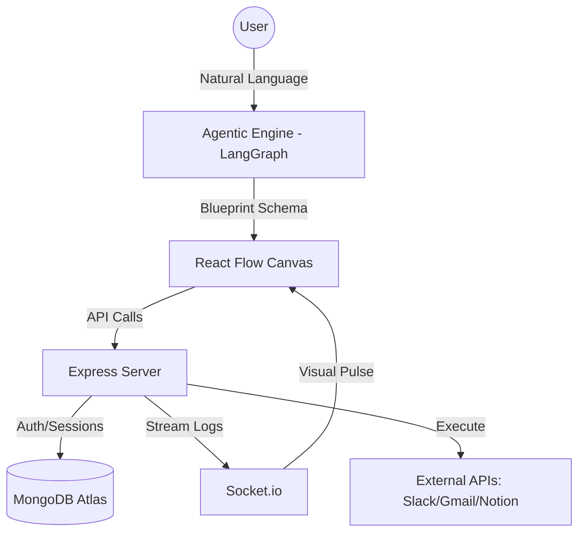

<p align="center">
  
</p>

<p align="center">
  <a href="https://orvexiaaiautomation.vercel.app/">
    
  </a>
</p>

<p align="center">
  <strong>"The Next Generation of Agentic Automation. Turn Intent into Executable Infrastructure."</strong>
</p>

<p align="center">
  
  
  
  
</p>

---

## 🚀 The Vision: Automation Reimagined

**ORvexia** is a high-fidelity, AI-native automation platform designed to bridge the gap between human intent and complex software execution. Traditional tools like Zapier or n8n require users to manually map JSON payloads and understand webhook logic. ORvexia eliminates this friction.

Powered by a state-aware **Agentic AI Engine (LangGraph + Gemini)**, ORvexia acts as a "Senior Workflow Architect." You describe your automation goals in plain English, and the platform autonomously designs, connects, and deploys the necessary logic, services, and error-handling branches.

### 🔗 [Access the Live Platform →](https://orvexiaaiautomation.vercel.app/)

---

## ✨ Core Pillars of ORvexia

### 🧠 1. Agentic Orchestration (Text-to-Logic)
Unlike simple LLM wrappers, ORvexia uses a **multi-agent orchestration layer**.
- **Contextual Reasoning**: It doesn't just "guess"; it reasons about the data types between nodes (e.g., mapping a Gmail 'Subject' to a Slack 'Title').
- **Tool Discovery**: Automatically identifies the correct integration from our curated library.
- **Auto-Correction**: The AI proactively suggests missing logic, such as adding a notification step if a critical execution fails.

### 🎨 2. Visual Architecture Canvas
A premium, "Glass-Box" engineering experience built on top of **React Flow**.
- **Native Node-Graph**: Drag, drop, and refine what the AI builds.
- **Glassmorphic UI**: A futuristic, high-performance interface styled with **Framer Motion** and **GSAP**.
- **Real-Time Execution Logs**: Watch your workflows pulse and execute data in real-time via **Socket.io** streams.

### 🏪 3. Blueprint Ecosystem
The **System Library** provides a gallery of enterprise-grade templates:
- **Productivity**: Gmail to Notion sync, automated meeting summaries.
- **Sales & CRM**: Stripe payment tracking to Slack alerts.
- **Development**: GitHub issue management and automated PR reviews.

### 💎 4. Tiered Infrastructure Scaling
Built-in subscription management for varying enterprise needs:
- **Basic**: 1 active high-availability workflow.
- **Pro & Elite**: Unlimited architectures, priority AI execution, and custom tool sandboxing.
- **Integrated Payments**: Secure billing lifecycle managed via **Razorpay**.

---

## 🛠️ The Tech Stack

| Layer | Technology |
| :--- | :--- |
| **Frontend** | React 19, Vite, Tailwind CSS, Framer Motion, GSAP |
| **Canvas UI** | React Flow (Graph Visualization) |
| **Backend** | Node.js, Express 5 (Modular Architecture) |
| **AI Engine** | LangGraph, Google Gemini Pro, LangChain |
| **Real-time** | Socket.io (Live Execution Streaming) |
| **Database** | MongoDB Atlas (Mongoose ODM) |
| **Auth** | Passport.js (Google/GitHub OAuth 2.0), JWT |
| **Billing** | Razorpay Payment Gateway |

---

## 🏗️ Architectural Overview



---

## 🚀 Local Installation & Setup

### 1. Prerequisites
- **Node.js** (v18.0.0+)
- **MongoDB** (Atlas or Local)
- **API Keys**: Google Gemini, Razorpay, and Passport credentials.

### 2. Environment Configuration
Create a `.env` file in `backend/express/` with the following:
```env
MONGODB_URI=your_mongodb_uri
JWT_SECRET=your_secret
GOOGLE_API_KEY=your_gemini_key
RAZORPAY_KEY_ID=your_key
```

### 3. Installation

```bash
# Clone the repository
git clone https://github.com/niloy-mallik/ORvexia.git
cd ORvexia

# Backend setup
cd backend/express
npm install

# Frontend setup
cd ../../frontend
npm install
```

### 4. Run the Development Environment

```bash
# Start Backend (from backend/express)
npm run dev

# Start Frontend (from frontend)
npm run dev
```

---

## 📄 Licensing & Credits
Distributed under the **MIT License**. Created and maintained by **Niloy Mallik**.

<p align="center">
  <em>"Automating the robotic drudgery of the 99% using Agentic AI."</em>
</p>
