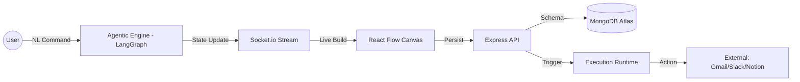

<p align="center">
  
</p>

<p align="center">
  <strong>"Automate Beyond Limits. Build Agentic Architectures with Natural Language."</strong>
</p>

<p align="center">
  
  
  
  
</p>

---

## 🌐 The Vision

**ORvexia** is a high-fidelity, agentic AI platform designed to transform abstract intent into production-ready executable infrastructure. By bridging the gap between natural language and complex logical architectures, ORvexia enables operations teams and developers to build autonomous automation systems without the friction of manual configuration.

Our platform leverages **LangGraph** and **Google Gemini** to act as a "Senior Workflow Architect"—analyzing requirements, selecting tools, and drawing the blueprint of your automation in real-time.

---

## 🖼️ Platform Experience

<p align="center">
  
</p>

<p align="center">
  <em>(Space for High-Resolution Dashboard & Builder Screenshots)</em>
</p>

---

## ✨ Enterprise Features

### 🧠 1. Agentic AI Copilot (Natural Language Orchestration)
The core of ORvexia is a state-aware agentic engine powered by **LangChain** and **LangGraph**.
- **Contextual Understanding**: Describe complex cross-platform tasks in one sentence.
- **Dynamic Tool Selection**: Automatically connects Gmail, Slack, Notion, and custom APIs.
- **Self-Correcting Blueprints**: The AI validates logic loops and data mappings before deployment.

### 🎨 2. High-Fidelity Visual Architect
A premium "Glass Box" engineering canvas built with **React Flow**.
- **Infrastructure Mapping**: Visualize your logic as a native node-based graph.
- **Micro-Motion UI**: Fluid interactions powered by **GSAP** and **Framer Motion**.
- **Hot-Reloading Builder**: Watch your architecture build itself as you speak to the AI.

### 🏪 3. Blueprint System Library
Access a curated ecosystem of pre-engineered architectures.
- **One-Click Deployments**: Instantly launch proven flows for Sales, HR, and Productivity.
- **Community Templates**: Share your best architectures or clone community favorites.
- **Version Control**: Manage and iterate on your workflow versions seamlessly.

### 💳 4. Subscription & Infrastructure Management
Professional-grade scaling with **Razorpay** integration.
- **Basic Tier**: 1 high-availability workflow for personal automation.
- **Pro & Elite Tiers**: Unlimited architectures, priority execution, and advanced agentic tools.
- **Real-time Monitoring**: Track execution logs and success rates via **Socket.io** streams.

---

## 🛠️ Technology Stack

### **Frontend Infrastructure**
- **Core**: [React 19](https://react.dev/) + [Vite 7](https://vitejs.dev/)
- **Visuals**: [React Flow](https://reactflow.dev/) (Graph Editor)
- **Design**: [Tailwind CSS](https://tailwindcss.com/) + [Lucide Icons](https://lucide.dev/)
- **Motion**: [Framer Motion](https://www.framer.com/motion/) & [GSAP](https://gsap.com/)
- **Analytics**: [Recharts](https://recharts.org/)

### **Backend & AI Core**
- **Engine**: [Node.js](https://nodejs.org/) + [Express 5](https://expressjs.com/)
- **Agentic AI**: [LangGraph](https://python.langchain.com/docs/langgraph) + [Gemini Pro](https://deepmind.google/technologies/gemini/)
- **Database**: [MongoDB Atlas](https://www.mongodb.com/) (Mongoose 9)
- **Auth**: [Passport.js](https://www.passportjs.org/) (OAuth 2.0)
- **Payments**: [Razorpay API](https://razorpay.com/)

---

## 🏗️ Technical Architecture



---

## 🚀 Getting Started

### 1. Requirements
- Node.js **v18+**
- MongoDB **v6.0+**
- API Keys: Google Gemini, Razorpay, and Passport Providers.

### 2. Quick Install

```bash
# Clone and enter directory
git clone https://github.com/niloy-mallik/ORvexia.git
cd ORvexia

# Backend Initialization
cd backend/express
npm install
cp .env.example .env

# Frontend Initialization
cd ../../frontend
npm install
```

### 3. Launch

```bash
# Terminal 1: Backend
cd backend/express
npm run dev

# Terminal 2: Frontend
cd frontend
npm run dev
```

---

## 📄 License
Licensed under the MIT License. Copyright © 2026 **Niloy Mallik**.

<p align="center">
  Built for the 1% of Workflow Architects who want to automate the other 99%.
</p>
